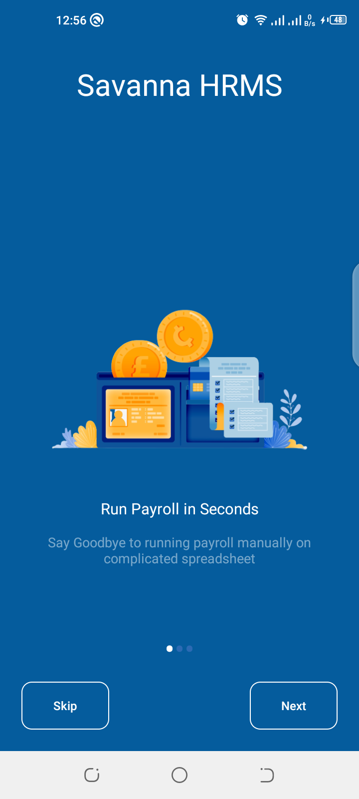
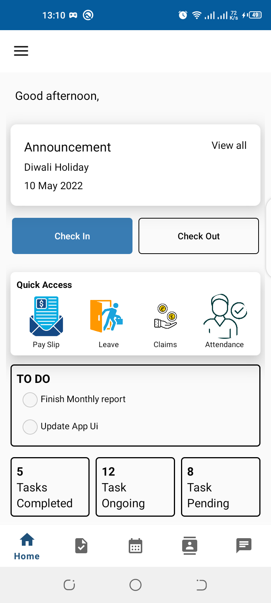
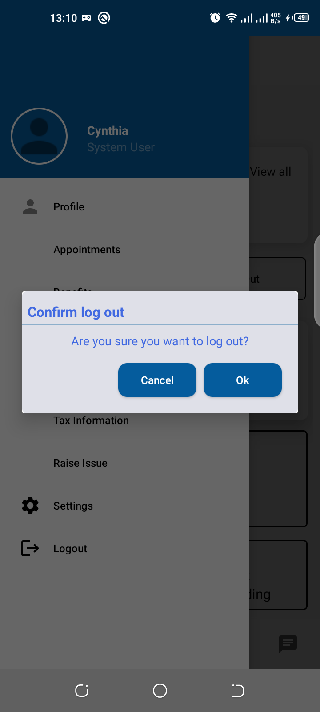

<b>The application utilizes erpnext APIs</b>

# HRMS

An application that allows employees to conduct their daily activities for example view profile, apply for leave, view salary slips, view holidays, claims, attendance, view tasks assigned to him/her, check in and check out, view todos etc.

Min Api Level: 16 

## Setup Requirements

- Android device or emulator
- Android Studio

## Getting Started

In order to get the app running yourself, you need to:

1. clone this project
2. Import the project into Android Studio
3. Connect the android device with USB or just use your emulator
4. In Android Studio, click on the "Run" button.
5. Don't forget to add your email and password on the util class, Ensure the emails are real for the JavaMailApi to work 

## Libraries

Libraries used in the whole application are:

- [Java](https://developer.android.com/) - Java works on different platforms (Windows, Mac, Linux, Raspberry Pi, etc.)
  It is one of the most popular programming language in the world
  It is easy to learn and simple to use
  It is open-source and free
  It is secure, fast and powerful
  It has a huge community support (tens of millions of developers)
  Java is an object oriented language which gives a clear structure to programs and allows code to be reused, lowering development costs
- [Navigation Components](https://developer.android.com/guide/navigation/navigation-getting-started) -  Helps you implement navigation, from simple button clicks to more complex patterns, such as app bars and the navigation drawer.
- [Frappe Framework with Erpnext API]((https://frappeframework.com/docs/user/en/api](https://frappeframework.com/docs/user/en/api/rest)))-

## Demo

  

  
## Support
- Found this project useful ❤️? Support by clicking the ⭐️ button on the upper right of this page. ✌️
- Notice anything else missing? File an issue 
- Feel free to contribute in any way to the project from typos in docs to code review are all welcome.
